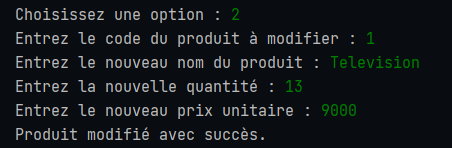

# Gestion de Stock

Un projet Java simple pour la gestion de stock, conçu comme un **travail pratique (TP)**. L'application fonctionne en mode console et propose plusieurs fonctionnalités basiques pour manipuler un stock de produits.

---

## Fonctionnalités

1. **Ajouter un produit** : Ajoutez un nouveau produit avec son code, nom, quantité et prix.
2. **Modifier un produit** : Modifiez les informations d'un produit existant.
3. **Supprimer un produit** : Supprimez un produit en utilisant son code.
4. **Afficher les produits** : Affichez la liste de tous les produits disponibles.
5. **Rechercher un produit** : Recherchez un produit par son nom.
6. **Calculer la valeur totale du stock** : Calculez la valeur des produits en stock.

---

## Instructions

1. Exécutez le programme dans un IDE comme IntelliJ IDEA ou Eclipse.
2. Suivez les options proposées dans le menu principal pour interagir avec l'application.
3. Testez chaque fonctionnalité selon les consignes du TP.

---

## Captures d'écran

### Menu principal

### Ajouter un produit

### Modifier un produit

### Supprimer un produit

### Afficher les produits

### Calculer la valeur totale

---

## Exemple de menu principal

---- Gestion de Stock ----
1. Ajouter un produit
2.Modifier un produit
3. Supprimer un produit
4.Afficher la liste des produits
5.Rechercher un produit
6.Calculer la valeur totale du stock
7.Quitter 

Choisissez une option :
---

## Auteur

Travail pratique réalisé par Anouar Zerrik.
